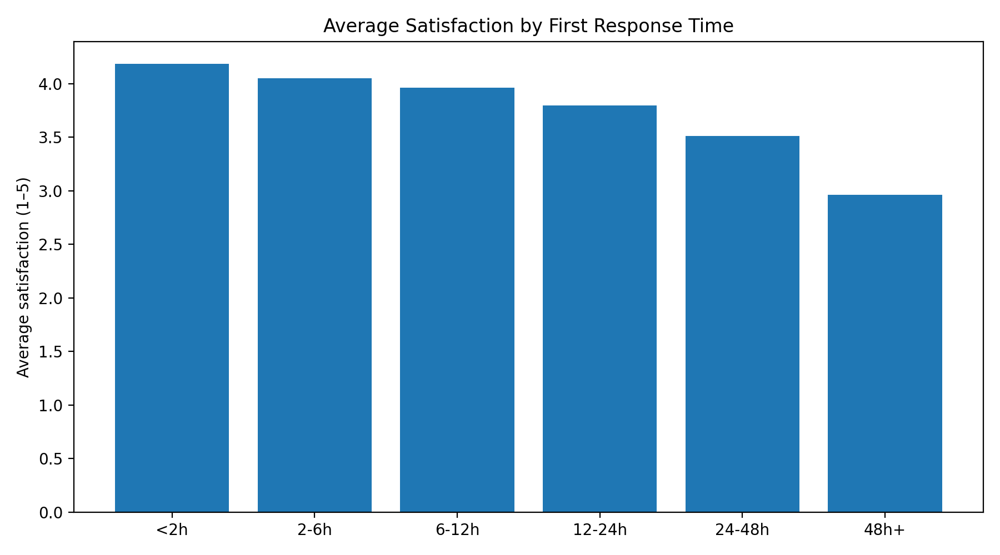

# Customer & Client Experience Insights

## How to navigate this repository
- The README provides the business context, approach, insights, and recommendations
- The analysis folder contains the supporting notebooks or scripts
- The visuals folder includes stakeholder-facing snapshots used to support decisions

## Overview
This project analyses customer and client experience data to uncover patterns that explain satisfaction, retention, and service performance. This project combines customer experience and client service analysis to generate insights that support retention and service performance improvements.

The focus is on turning experience metrics into insights that inform service improvement decisions.

## Business context
Organisations often collect large volumes of customer and client data but struggle to translate it into actionable insight.

This project reflects a scenario where teams want to:
- Understand drivers of satisfaction and dissatisfaction
- Improve service delivery
- Reduce churn risk

## Key business question
What patterns in customer and client behaviour help explain experience outcomes, and how can these insights inform service improvements?

## Data & assumptions
The analysis uses realistic customer and service-related indicators such as:
- Interaction frequency
- Response times
- Satisfaction or feedback scores

Data limitations are acknowledged, reflecting real-world conditions.

## Analytical approach
- Explore relationships between service interactions and experience outcomes
- Segment customers based on behavioural and experience indicators
- Identify signals associated with positive and negative experiences

## Insight snapshot

*Snapshot linking service response times to client satisfaction to inform service improvement priorities.*

## Key insights
- Experience outcomes are often influenced by consistency rather than volume of interaction
- Delays or unresolved issues disproportionately impact satisfaction
- Not all clients require the same service approach to achieve positive outcomes

## Recommended actions
- Focus service improvements on high-impact touchpoints
- Tailor service models to different client segments
- Monitor experience indicators alongside commercial metrics
  
## Skills demonstrated
- Business analysis and decision framing
- Data analysis using Python and SQL
- Commercial performance evaluation
- Stakeholder-focused insight communication

## Tools used
- Python for exploratory analysis
- Business analysis and segmentation techniques
- Data storytelling principles

## Limitations & next steps
Future development could include:
- Integration with revenue or account data
- Predictive churn indicators
- Deeper qualitative insight
